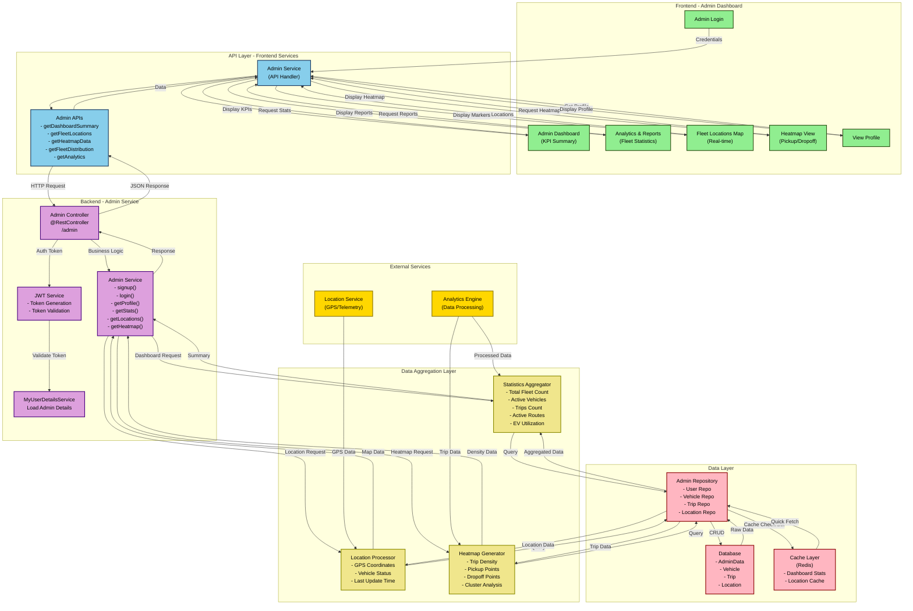

# Admin Data Flow Diagram (DFD)

## Overview
This DFD represents the data flow for Admin operations including system monitoring, dashboard analytics, fleet statistics, and heatmap visualization.

## Data Entities

### 1. AdminData
- adminId
- name
- email
- phone
- password (hashed)
- adminRole (SUPER_ADMIN, ADMIN)
- department
- permissions
- status

### 2. Vehicle
- regNo (Primary Key)
- model
- fuelType
- currentFuel
- mileage
- status
- assignedFleetManager
- location
- lastUpdated

### 3. Trip
- tripId
- vehicleRegNo
- driverId
- startLocation
- endLocation
- startTime
- endTime
- distance
- cost

### 4. Location
- locationId
- vehicleRegNo
- latitude
- longitude
- timestamp
- speed
- heading

### 5. Dashboard Summary (KPIs)
- totalFleet
- activeVehicles
- tripsToday
- activeRoutes
- evUtilization (%)

## API Endpoints

| Method | Endpoint | Description |
|--------|----------|-------------|
| POST | `/admin/signup` | Register new Admin |
| POST | `/admin/login` | Admin Login |
| POST | `/admin/logout` | Logout Admin |
| POST | `/admin/profile` | Get Admin Profile |
| GET | `/admin/stats/summary` | Get Dashboard KPIs |
| GET | `/admin/fleet/locations` | Get Fleet Locations |
| GET | `/admin/trips/heatmap` | Get Heatmap Data |
| GET | `/admin/analytics/reports` | Get Analytics Reports |
| GET | `/admin/fleet/distribution` | Get Fleet Distribution |

## Data Flow Steps

1. **Authentication Flow**
   - Admin enters credentials
   - Frontend sends login request
   - Backend validates against AdminData table
   - JWT token generated with admin role
   - Token stored in frontend storage

2. **Dashboard Summary Flow**
   - Admin accesses dashboard
   - Frontend requests KPI summary
   - Backend aggregator queries:
     - Total vehicles from Vehicle table
     - Active vehicles (status = ACTIVE)
     - Today's trips from Trip table
     - Active routes from Route table
     - EV utilization percentage
   - Data cached in Redis for performance
   - Summary displayed on dashboard

3. **Fleet Locations Flow**
   - Admin requests real-time locations
   - Frontend sends location request
   - Location service provides GPS data
   - Processor queries latest Location records
   - Markers generated for map display
   - Real-time updates via WebSocket/Polling

4. **Heatmap Data Flow**
   - Admin requests heatmap view
   - Heatmap generator queries Trip table
   - Extracts start/end locations
   - Calculates trip density by area
   - Generates cluster data
   - Displays as gradient overlay on map

5. **Analytics Report Flow**
   - Analytics engine processes raw trip data
   - Generates statistics:
     - Total trips by day/week/month
     - Revenue metrics
     - Driver performance
     - Vehicle utilization
   - Reports formatted and sent to frontend
   - Cached for quick access

## Key Features

- **Real-time Monitoring**: Live vehicle locations with minimal latency
- **Analytics**: Comprehensive trip and fleet statistics
- **Performance**: Redis caching for frequently accessed data
- **Scalability**: Aggregation layer handles large datasets
- **Security**: JWT-based authentication with role-based access
