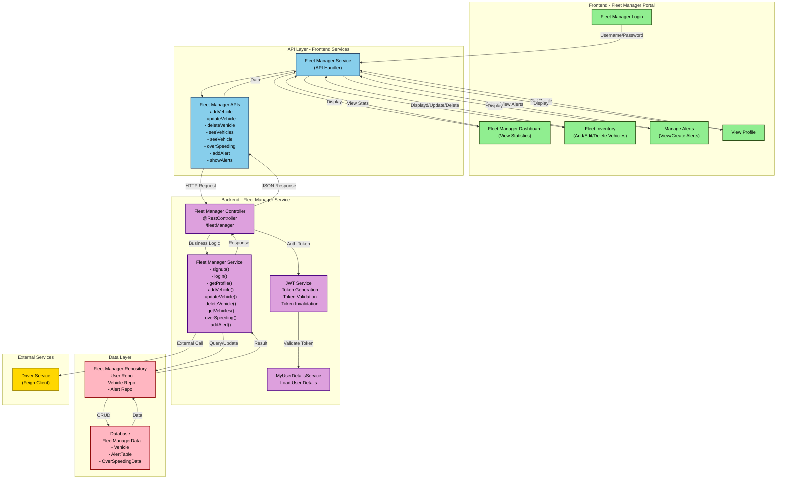

# FleetManager Data Flow Diagram (DFD)

## Overview
This DFD represents the data flow for Fleet Manager operations including vehicle management, alerts, and monitoring.

## Data Entities

### 1. FleetManagerData
- fleetManagerId
- name
- email
- phone
- password (hashed)
- company
- status

### 2. Vehicle
- regNo (Primary Key)
- model
- fuelType
- currentFuel
- mileage
- location
- status
- maintenanceDate

### 3. AlertTable
- alertId
- fleetManagerId
- vehicleRegNo
- alertType (MAINTENANCE, FUEL, OVERSPEED, etc.)
- severity (HIGH, MEDIUM, LOW)
- description
- createdAt
- resolvedAt

### 4. OverSpeedingData
- speedingId
- regNo
- speed
- location
- timestamp

## API Endpoints

| Method | Endpoint | Description |
|--------|----------|-------------|
| POST | `/fleetManager/signup` | Register new Fleet Manager |
| POST | `/fleetManager/login` | Fleet Manager Login |
| POST | `/fleetManager/logout` | Logout Fleet Manager |
| POST | `/fleetManager/profile` | Get Fleet Manager Profile |
| POST | `/fleetManager/addVehicle` | Add New Vehicle |
| POST | `/fleetManager/updateVehicle` | Update Vehicle (Fuel) |
| POST | `/fleetManager/deleteVehicle` | Delete Vehicle |
| POST | `/fleetManager/seeVehicles` | Get All Vehicles |
| POST | `/fleetManager/seeVehicle` | Get Single Vehicle |
| POST | `/fleetManager/overSpeeding` | Record Overspeeding Incident |
| POST | `/fleetManager/addAllert` | Create Alert |
| POST | `/fleetManager/showAllAllerts` | View All Alerts |

## Data Flow Steps

1. **Authentication Flow**
   - Fleet Manager enters credentials
   - Frontend sends signup/login request
   - Backend validates against database
   - JWT token generated
   - Token stored in frontend storage

2. **Vehicle Management Flow**
   - Fleet Manager adds/updates/deletes vehicle
   - Frontend validates input
   - Request sent with auth token
   - Backend validates token via JWT service
   - Service queries/updates vehicle repository
   - Database persists changes
   - Response returned to frontend
   - UI updates with new data

3. **Alert Management Flow**
   - System records overspeeding or maintenance events
   - Alert created with severity level
   - Alert stored in database
   - Fleet Manager views alerts on dashboard
   - Alerts can be acknowledged or resolved

4. **Profile Management Flow**
   - Fleet Manager requests profile
   - Token validated
   - User service retrieves data from database
   - Profile data returned and displayed
