# User (Customer) Data Flow Diagram (DFD)

## Overview
This DFD represents the data flow for Customer/User operations including vehicle browsing, booking, trip management, and payment processing.

```mermaid
graph TB
    subgraph Frontend["Frontend - Customer Portal"]
        User_Login["Customer Login"]
        User_Browse["Browse Available<br/>Vehicles"]
        User_Booking["Book Vehicle<br/>(Date/Time/Location)"]
        User_MyBookings["View My Bookings<br/>(Upcoming & History)"]
        User_Payment["Payment & Checkout"]
        User_Profile["View Profile"]
        User_Support["Support/Chat"]
    end
    
    subgraph API_Layer["API Layer - Frontend Services"]
        User_Service["User Service<br/>(API Handler)"]
        User_APIs["User APIs<br/>- signup<br/>- login<br/>- getAvailableVehicles<br/>- bookVehicle<br/>- getBookings<br/>- updateProfile<br/>- processPayment"]
    end
    
    subgraph Backend["Backend - User/Customer Service"]
        User_Controller["User Controller<br/>@RestController<br/>/user"]
        User_BizLogic["User Service<br/>- signup()<br/>- login()<br/>- getProfile()<br/>- getAvailableVehicles()<br/>- bookVehicle()<br/>- getBookings()<br/>- updateProfile()"]
        User_JWT["JWT Service<br/>- Token Generation<br/>- Token Validation"]
        User_UserDetailsService["MyUserDetailsService<br/>Load User Details"]
    end
    
    subgraph Business_Logic["Business Logic Layer"]
        Availability_Engine["Vehicle Availability<br/>Engine<br/>- Check Status<br/>- Validate Dates<br/>- Calculate Cost"]
        Booking_Manager["Booking Manager<br/>- Create Booking<br/>- Update Status<br/>- Cancel Booking<br/>- Send Confirmation"]
        Payment_Processor["Payment Processor<br/>- Process Payment<br/>- Validate Amount<br/>- Generate Receipt"]
        Notification_Service["Notification Service<br/>- Email Alerts<br/>- SMS Alerts<br/>- In-app Notifications"]
    end
    
    subgraph Data_Layer["Data Layer"]
        User_Repo["User Repository<br/>- User Repo<br/>- Vehicle Repo<br/>- Booking Repo<br/>- Payment Repo"]
        User_DB["Database<br/>- UserData<br/>- Vehicle<br/>- Booking<br/>- Payment"]
    end
    
    subgraph External["External Services"]
        Fleet_Manager_Service["Fleet Manager Service<br/>(Inventory Check)"]
        Payment_Gateway["Payment Gateway<br/>(Stripe/Razorpay)"]
        Email_Service["Email Service<br/>(Sendgrid/SMTP)"]
        SMS_Service["SMS Service<br/>(Twilio/AWS SNS)"]
    end
    
    %% Frontend Flows
    User_Login -->|Email/Password| User_Service
    User_Browse -->|View Available| User_Service
    User_Booking -->|Submit Booking| User_Service
    User_MyBookings -->|Request History| User_Service
    User_Payment -->|Payment Details| User_Service
    User_Profile -->|Get/Update Profile| User_Service
    User_Support -->|Contact Support| User_Service
    
    %% API Layer to Backend
    User_Service --> User_APIs
    User_APIs -->|HTTP Request| User_Controller
    
    %% Controller Flow
    User_Controller -->|Auth Token| User_JWT
    User_JWT -->|Validate Token| User_UserDetailsService
    User_Controller -->|Business Logic| User_BizLogic
    
    %% Service to Business Logic
    User_BizLogic -->|Get Vehicles| Availability_Engine
    User_BizLogic -->|Create Booking| Booking_Manager
    User_BizLogic -->|Process Payment| Payment_Processor
    
    %% External Service Calls
    Availability_Engine -->|Check Availability| Fleet_Manager_Service
    Booking_Manager -->|Send Confirmation| Notification_Service
    Payment_Processor -->|Process| Payment_Gateway
    Notification_Service -->|Send Email| Email_Service
    Notification_Service -->|Send SMS| SMS_Service
    
    %% Data Layer Queries
    Availability_Engine -->|Query Available| User_Repo
    Booking_Manager -->|CRUD| User_Repo
    Payment_Processor -->|Store Payment| User_Repo
    
    %% Data Operations
    User_Repo -->|CRUD| User_DB
    User_BizLogic -->|Query| User_Repo
    
    %% Response Flow
    User_DB -->|Raw Data| User_Repo
    User_Repo -->|Vehicle List| Availability_Engine
    User_Repo -->|Booking Data| Booking_Manager
    User_Repo -->|Payment Data| Payment_Processor
    
    Availability_Engine -->|Available Vehicles| User_BizLogic
    Booking_Manager -->|Booking Confirmation| User_BizLogic
    Payment_Processor -->|Payment Status| User_BizLogic
    
    User_BizLogic -->|Response| User_Controller
    User_Controller -->|JSON Response| User_APIs
    User_APIs -->|Data| User_Service
    
    User_Service -->|Display Vehicles| User_Browse
    User_Service -->|Confirmation| User_Booking
    User_Service -->|History| User_MyBookings
    User_Service -->|Receipt| User_Payment
    User_Service -->|Profile Data| User_Profile
    User_Service -->|Messages| User_Support
    
    %% Styles
    classDef frontend fill:#90EE90,stroke:#2d5016,stroke-width:2px,color:#000
    classDef api fill:#87CEEB,stroke:#1e3a5f,stroke-width:2px,color:#000
    classDef backend fill:#DDA0DD,stroke:#4a0080,stroke-width:2px,color:#000
    classDef business fill:#F0E68C,stroke:#8B8B00,stroke-width:2px,color:#000
    classDef data fill:#FFB6C1,stroke:#8B0000,stroke-width:2px,color:#000
    classDef external fill:#FFD700,stroke:#8B7500,stroke-width:2px,color:#000
    
    class User_Login,User_Browse,User_Booking,User_MyBookings,User_Payment,User_Profile,User_Support frontend
    class User_Service,User_APIs api
    class User_Controller,User_BizLogic,User_JWT,User_UserDetailsService backend
    class Availability_Engine,Booking_Manager,Payment_Processor,Notification_Service business
    class User_Repo,User_DB data
    class Fleet_Manager_Service,Payment_Gateway,Email_Service,SMS_Service external
```

## Data Entities

### 1. UserData
- userId
- firstName
- lastName
- email
- phone
- password (hashed)
- address
- city
- state
- pinCode
- licenseNumber
- licenseExpiry
- profilePicture
- status (ACTIVE, SUSPENDED, INACTIVE)
- createdAt

### 2. Vehicle
- regNo (Primary Key)
- model
- fuelType
- capacity
- rentalPrice (per day/hour)
- currentLocation
- status (AVAILABLE, BOOKED, MAINTENANCE)
- images
- features
- fleetManagerId

### 3. Booking
- bookingId
- userId
- vehicleRegNo
- pickupLocation
- dropoffLocation
- pickupDate
- pickupTime
- dropoffDate
- dropoffTime
- estimatedCost
- actualCost
- bookingStatus (PENDING, CONFIRMED, IN_PROGRESS, COMPLETED, CANCELLED)
- specialRequests
- createdAt
- updatedAt

### 4. Payment
- paymentId
- bookingId
- userId
- amount
- paymentMethod (CREDIT_CARD, DEBIT_CARD, WALLET, NET_BANKING)
- transactionId
- paymentStatus (PENDING, SUCCESS, FAILED, REFUNDED)
- receipt
- processedAt

### 5. Notification
- notificationId
- userId
- type (EMAIL, SMS, IN_APP)
- title
- message
- status (SENT, DELIVERED, FAILED)
- createdAt

## API Endpoints

| Method | Endpoint | Description |
|--------|----------|-------------|
| POST | `/user/signup` | Register new customer |
| POST | `/user/login` | Customer login |
| POST | `/user/logout` | Logout customer |
| POST | `/user/profile` | Get customer profile |
| PUT | `/user/profile` | Update profile |
| POST | `/user/getAvailableVehicles` | Get available vehicles |
| POST | `/user/bookVehicle` | Create new booking |
| POST | `/user/getBookings` | Get booking history |
| GET | `/user/booking/{bookingId}` | Get booking details |
| POST | `/user/cancelBooking` | Cancel booking |
| POST | `/user/processPayment` | Process payment |
| GET | `/user/invoices` | Get invoices |

## Data Flow Steps

### 1. Authentication Flow
- Customer registers with email, phone, and license details
- Password hashed and stored securely
- Login validates credentials
- JWT token generated with userId
- Token used for subsequent requests

### 2. Vehicle Browse Flow
- Customer requests available vehicles
- Availability Engine checks:
  - Vehicle status = AVAILABLE
  - Requested dates are free
  - Vehicle location matches search criteria
- Queries Fleet Manager Service for current availability
- Returns filtered list with pricing
- Frontend displays vehicles with images and details

### 3. Booking Flow
- Customer selects vehicle and dates
- Availability Engine validates:
  - Vehicle still available
  - No conflicts with other bookings
  - Customer eligibility (license valid, no pending issues)
- Booking Manager creates booking record
- Calculates rental cost
- Sets booking status to PENDING
- Confirmation sent via email and SMS
- Booking confirmed and status updated

### 4. Payment Flow
- Customer enters payment details
- Payment Processor validates amount
- Calls Payment Gateway (Stripe/Razorpay)
- On success:
  - Payment record created
  - Booking status changed to CONFIRMED
  - Receipt generated
  - Invoice sent to customer
  - Confirmation notification sent
- On failure:
  - Error returned to customer
  - Booking remains PENDING
  - Option to retry

### 5. Booking History Flow
- Customer requests past and upcoming bookings
- Service queries Booking table filtered by userId
- Returns organized by status (UPCOMING, COMPLETED, CANCELLED)
- Includes vehicle details, dates, costs
- Allows access to invoices and receipts

### 6. Notification Flow
- System triggers notifications for:
  - Booking confirmation
  - Payment receipt
  - Pickup reminders
  - Trip start/completion
  - Payment receipts
- Multi-channel delivery:
  - Email via Email Service
  - SMS via SMS Service
  - In-app notifications stored in database

## Key Features

- **Real-time Availability**: Vehicle availability checked against bookings
- **Flexible Booking**: Multiple time slot and location options
- **Secure Payment**: Integration with major payment gateways
- **Automated Notifications**: Multi-channel alerts for bookings and payments
- **License Validation**: Ensures driver has valid license
- **Booking History**: Easy access to past transactions
- **Responsive UI**: Mobile-friendly booking interface
- **Support Integration**: In-app chat for customer support

## Data Security

- Password hashing using bcrypt
- JWT token-based authentication
- SSL/TLS for data transmission
- Payment data handled by PCI-compliant gateway
- Sensitive data encrypted at rest
- Role-based access control
